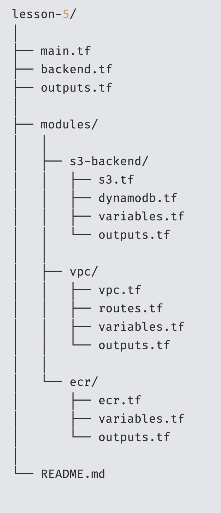

## Project Overview

This Terraform project sets up infrastructure on AWS, including:

- Remote backend state management using S3 and DynamoDB
- A VPC with public and private subnets
- An Elastic Container Registry (ECR) repository

## File Structure

- `main.tf` — the main entry point to invoke modules
- `backend.tf` — backend configuration for remote state (S3 + DynamoDB)
- `outputs.tf` — aggregated outputs from all modules

### Modules

- `modules/s3-backend/` — creates an S3 bucket and DynamoDB table for Terraform state management
- `modules/vpc/` — sets up a VPC, subnets, route tables, internet/NAT gateways
- `modules/ecr/` — creates an ECR repository with image scanning and access policies

## Usage

```hcl
terraform init
terraform plan
terraform apply
terraform destroy
```
