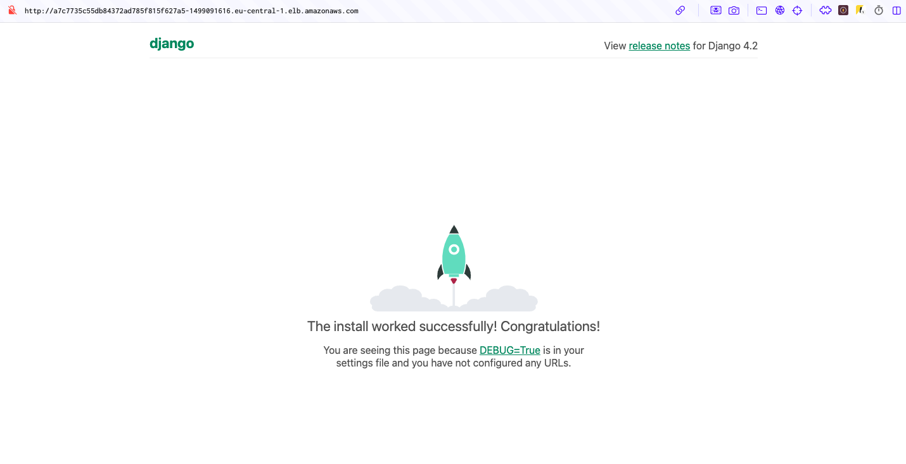
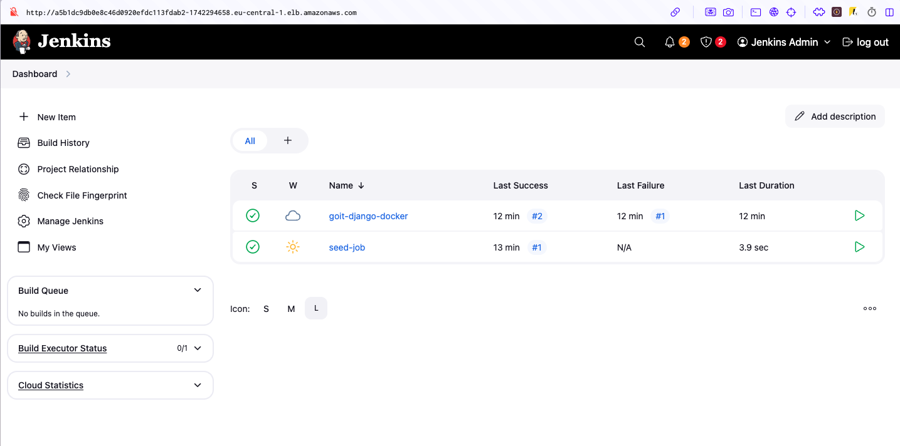
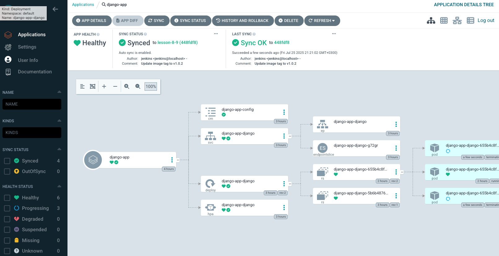
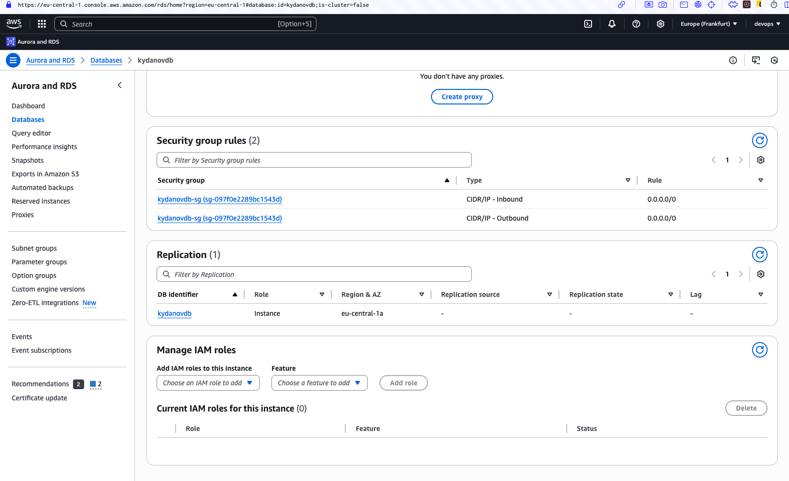
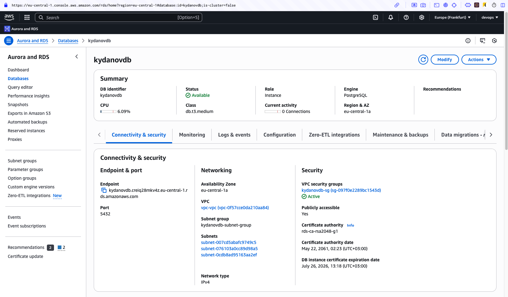
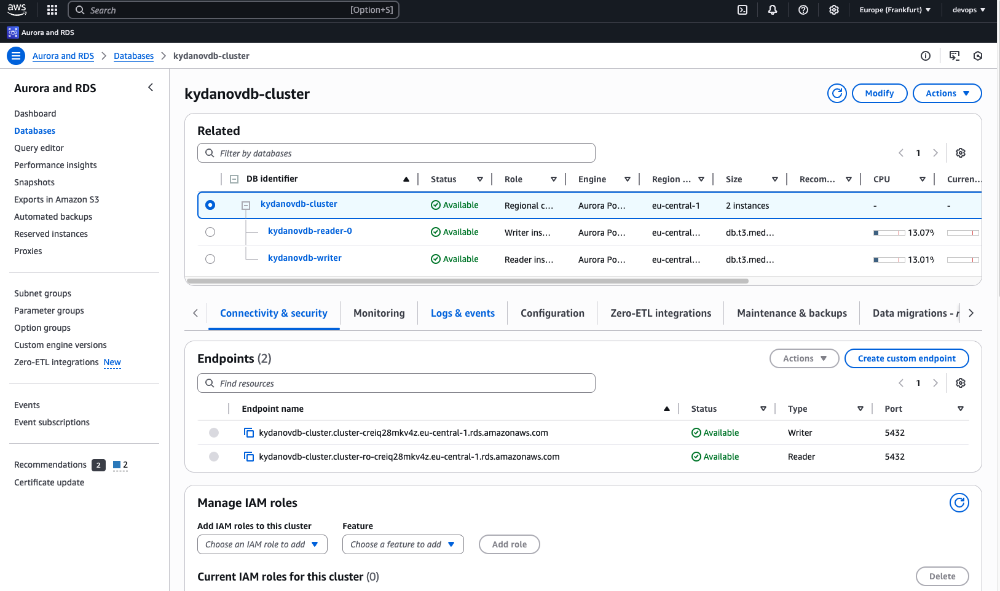
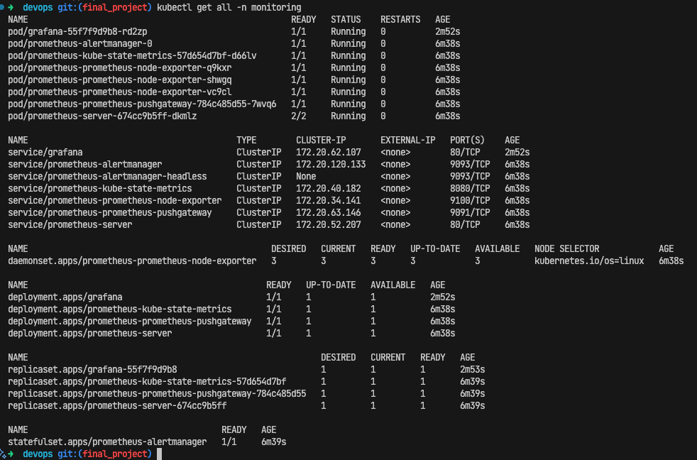
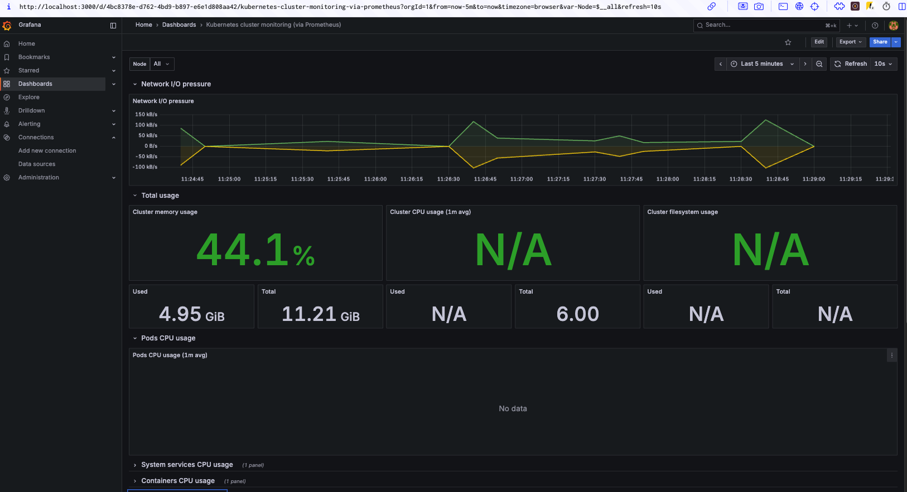

# DevOps Lesson 8–9 – Full CI/CD Pipeline with Jenkins, Helm, Terraform & Argo CD

## Overview

This project implements a complete CI/CD pipeline for a Django application using:
- **Jenkins** for building and pushing Docker images
- **Terraform** for provisioning AWS infrastructure
- **Amazon ECR** for storing Docker images
- **Helm** for Kubernetes deployment
- **Argo CD** for GitOps-based synchronization into EKS

---

## Architecture

```text
GitHub (main branch)
      |
   Jenkins (pipeline build via Jenkinsfile)
      |
   Docker image → Amazon ECR
      |
   values.yaml updated in Git repo (new tag)
      |
   Argo CD detects change and deploys to EKS
```

---

## Project Structure

```
lesson-8-9/
├── main.tf                  # Entry point for Terraform modules
├── backend.tf               # Backend config (S3 + DynamoDB)
├── outputs.tf               # Global outputs
├── Jenkinsfile              # CI pipeline definition
├── modules/
│   ├── vpc/                 # AWS VPC configuration
│   ├── rds/                 # RDS/Aurora database configuration
│   ├── ecr/                 # Elastic Container Registry
│   ├── eks/                 # Kubernetes Cluster (EKS)
│   ├── jenkins/             # Jenkins Helm deployment + config
│   └── argo_cd/             # Argo CD Helm deployment + Application management
├── charts/
│   └── django-app/          # Helm chart for Django application
│       ├── templates/
│       └── values.yaml
```

---

## Setup Instructions

### 1. Provision Infrastructure

```bash
cd lesson-8-9
terraform init
terraform plan
terraform apply
```

### 2. Login to aws ECR

```bash
aws ecr get-login-password --region <your-region> | docker login --username AWS --password-stdin <your-account-id>.dkr.ecr.<your-region>.amazonaws.com
```
### 3. Build and Push Docker Image

```bash
# Build Docker image
docker build -t lesson-8-9 .

# Tag the image for ECR
docker tag lesson-8-9:latest <your-account-id>.dkr.ecr.<your-region>.amazonaws.com/lesson-8-9-ecr:latest

# Push the image to ECR
docker push <your-account-id>.dkr.ecr.<your-region>.amazonaws.com/lesson-8-9-ecr:latest
```

---

### 4. Configure kubectl and Deploy with Helm

```bash
# Update kubeconfig for your EKS cluster
aws eks --region <your-region> update-kubeconfig --name <your-cluster-name>

# Verify access to the cluster
kubectl get nodes
```

#### Deploy Django App using Helm

```bash
# Navigate to the Helm chart directory
cd charts/django-app

# Update values.yaml with your ECR image repository and tag

# Install the Helm chart
helm install django-app .
```

```bash
# Get the external URL for the service
kubectl get svc
```
Find the `EXTERNAL-IP` for the `django-app-django` service and open it in your browser to access the Django application.

## Screenshots

### Django Application



### Jenkins Pipeline



### Argo CD Dashboard



### RDS Configuration



### Aurora RDS Configuration


## CI/CD Flow

### Jenkins

1. Clones repo and builds Docker image via `Dockerfile`
2. Pushes image to ECR
3. Updates `charts/django-app/values.yaml` with the new image tag
4. Pushes changes to Git (main branch)

### Argo CD

1. Monitors the Git repository for updates
2. Automatically syncs Helm chart into the EKS cluster
3. Deploys new version of the app using updated image

---

## Helm Deployment Details

- `deployment.yaml` uses `envFrom` to pull variables from ConfigMap
- `service.yaml` exposes app via LoadBalancer
- `hpa.yaml` scales app from 2 to 6 pods at >70% CPU
- `configmap.yaml` holds Django ENV variables

---

## Notes

- Jenkins uses Kaniko for building images inside Kubernetes
- All provisioning is done via Terraform
- Argo CD manages apps using declarative GitOps approach

# Terraform RDS Module

Universal module for creating an AWS RDS instance or Aurora cluster with minimal variable changes.

## Supported Options

- Standard RDS instance (PostgreSQL, MySQL, etc.)
- Aurora Cluster (PostgreSQL-compatible, MySQL-compatible)

The module automatically creates:

- DB Subnet Group
- Security Group
- Parameter Group

## Input Variables

| Name                            | Type        | Required | Description                                                                 |
| ------------------------------- | ----------- | -------- | --------------------------------------------------------------------------- |
| `name`                          | string      | ✅       | Identifier (name) for the instance or cluster                               |
| `use_aurora`                    | bool        | ✅       | If `true`, an Aurora Cluster will be created                                |
| `engine`                        | string      | ✅       | Database engine: `postgres`, `mysql`, `aurora-postgresql`, `aurora-mysql`   |
| `engine_version`                | string      | ✅       | Database version (e.g., `15.3`)                                              |
| `instance_class`                | string      | ✅       | EC2 instance class (e.g., `db.t3.medium`)                                    |
| `allocated_storage`             | number      | ❌       | Storage size (only for standard RDS)                                        |
| `aurora_instance_count`         | number      | ❌       | Number of instances in the Aurora cluster                                   |
| `db_name`                       | string      | ✅       | Name of the database (must start with a letter and not contain special chars) |
| `username`                      | string      | ✅       | Username for database access                                                |
| `password`                      | string      | ✅       | Password for the database user                                              |
| `multi_az`                      | bool        | ❌       | If `true`, enables Multi-AZ for RDS                                          |
| `publicly_accessible`           | bool        | ❌       | If `true`, the instance will be publicly accessible                         |
| `backup_retention_period`       | number      | ❌       | Number of days to retain backups                                            |
| `parameter_group_family_rds`    | string      | ✅ (RDS) | Example: `postgres15`                                                       |
| `parameter_group_family_aurora` | string      | ✅ (Aurora) | Example: `aurora-postgresql15`                                           |
| `parameters`                    | map(string) | ❌       | Additional DB parameters (key-value pairs)                                  |
| `tags`                          | map(string) | ❌       | Resource tags                                                               |

## How to Update Engine, Type, Class, etc.

| What to Change                  | How                                                                 |
| ------------------------------ | ------------------------------------------------------------------- |
| 🔁 Standard RDS ↔ Aurora        | Toggle `use_aurora` between `true` and `false`                      |
| 🔁 Engine (PostgreSQL, MySQL)   | Modify `engine` and `engine_version`                                |
| 🔁 Instance Class               | Update `instance_class` (e.g., `db.t3.micro`)                        |
| 🔁 Database Name                | Modify `db_name`                                                    |
| 🛠️ DB Parameters                | Add entries to `parameters` map (key-value pairs)                   |


## Grafana Dashboard
```Instalation Steps:
   kubectl create namespace monitoring
   helm repo add prometheus-community https://prometheus-community.github.io/helm-charts
   helm repo update
   helm install prometheus prometheus-community/prometheus --namespace monitoring

   helm repo add grafana https://grafana.github.io/helm-charts
   helm repo update


   helm install grafana grafana/grafana --namespace monitoring --set adminPassword=admin123
   kubectl port-forward -n monitoring svc/grafana 3000:80
```




